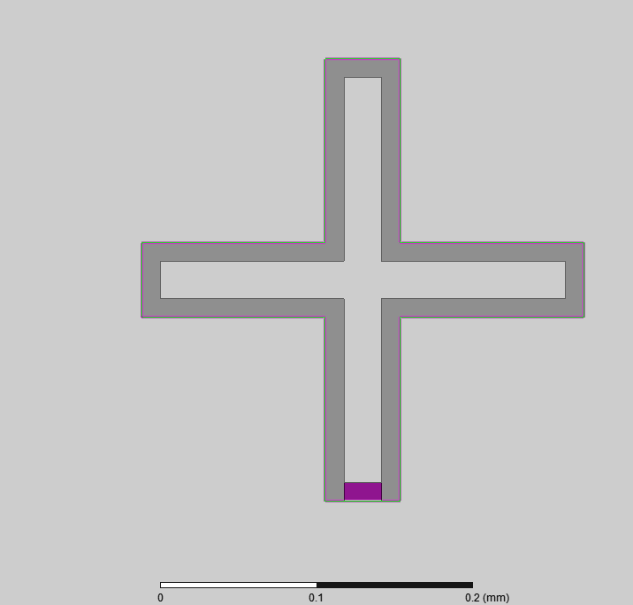

Welcome to pyEPR :beers:! &nbsp;&nbsp;&nbsp;&nbsp;&nbsp;(see [arXiv:2010.00620](https://arxiv.org/abs/2010.00620))
===================
[](https://github.com/zlatko-minev/pyEPR)
[](https://github.com/zlatko-minev/pyEPR)
[](https://github.com/zlatko-minev/pyEPR)
[](https://github.com/zlatko-minev/pyEPR/fork)
[](https://conda.anaconda.org/conda-forge)
[](https://badge.fury.io/py/pyEPR-quantum)
[](https://zenodo.org/badge/latestdoi/101073856)
 
### Automated Python module for the design and quantization of Josephson quantum circuits


### Documentation

[Read the docs here.](https://pyepr-docs.readthedocs.io)
<br>

## Scientific work:
* Minev, Z. K., Leghtas, Z., Mudhada, S. O., Reinhold, P., Diringer, A., & Devoret, M. H. (2018). [pyEPR: The energy-participation-ratio (EPR) open-source framework for quantum device design.](https://github.com/zlatko-minev/pyEPR/blob/master/pyEPR.bib)  [](https://zenodo.org/badge/latestdoi/101073856)
* Minev, Z. K., Leghtas, Z., Mundhada, S. O., Christakis, L., Pop, I. M., & Devoret, M. H. (2020). Energy-participation quantization of Josephson circuits. ArXiv. Retrieved from http://arxiv.org/abs/2010.00620 (2020)
* Z.K. Minev, Ph.D. Dissertation, Yale University (2018), Chapter 4. ([arXiv:1902.10355](https://arxiv.org/abs/1902.10355))  (2018) 

## pyEPR Working group meeting -- Planning for the future of pyEPR

* Please sign-up here: https://github.com/zlatko-minev/pyEPR/issues/45 or [directly here](https://docs.google.com/forms/d/e/1FAIpQLScd3WyfzDS47D0WB9skkSPQAXCnKLf7JMxsZ7BnMwK0LjE3Sw/viewform?usp=sf_link) :bangbang: :beers:
- See [pyEPR wiki](https://github.com/zlatko-minev/pyEPR/wiki) for notes from first meeting.
- We will schedule a follow-up meeting in 1-2 mo.

<br>

## Who uses pyEPR?
* Yale University, Michel Devoret lab [QLab](https://qulab.eng.yale.edu/), CT, USA
* Yale University, Rob Schoelkopf lab [RSL](https://rsl.yale.edu/), CT, USA
* [IBM Quantum](https://www.ibm.com/quantum-computing/) and IBM's Qiskit Metal
* [QUANTIC](https://team.inria.fr/quantic/people.html#) (QUANTUM INFORMATION CIRCUITS), PARISINRIA, ENS, MINES PARISTECH, UPMC, CNRS. Groups of Zaki Leghtas and team. France
* [Quantum Circuit Group](http://www.physinfo.fr/) Benjamin Huard, Ecole Normale Supérieure de Lyon, France
* Emanuel Flurin, CEA Saclay, France
* Ioan Pop group, KIT Physikalisches Institut, Germany 
* UC Berkeley, [Quantum Nanoelectronics Laboratory](https://physics.berkeley.edu/quantum-nanoelectronics-laboratory), Irfan Siddiqi, CA, USA
* [Quantum Circuits, Inc.](https://quantumcircuits.com/), CT, USA
* [Seeqc](https://seeqc.com/) (spin-out of Hypres) Digital Quantum Computing, USA
* Serge [Rosenblum Lab] quantum circuits group (https://www.weizmann.ac.il/condmat/rosenblum/) in the Weizmann Instatue, Israel
* University of Oxford - LeekLab - Peter [Leek Lab](https://leeklab.org/), UK
* Britton [Plourde Lab](https://bplourde.expressions.syr.edu/), Syracuse University, USA
* Javad [Shabani Lab](https://wp.nyu.edu/shabanilab/) Quantum Materials & Devices, NYU, NY, USA
* UChicago Dave Schuster Lab, USA
* SQC lab - Shay Hacohen Gourgy, Israel
* Lawrence Berkeley National Lab
* Colorado School of Mines, USA
* Syracuse University, USA
* IPQC, SJTU, Shanghai, China
* Bhabha Atomic Research Centre, India
* Quantum Computing UK
* Alice&Bob, France
* Centre for Quantum Technologies / Qcrew
* Quantum Device Lab ETHZ; Andreas Wallraff
* Bleximo
* ... and many more! (Please e-mail `zlatko.minev@aya.yale.edu` with updates.)


<br>

# Contents:
* [Start here: Using `pyEPR`](#start-here-using-pyepr)
* [Video Tutorials](#pyepr-video-tutorials)
* [Setup and Installation](#installation-and-setup-of-pyepr)
* [HFSS Project Setup for `pyEPR`](#hfss-project-setup-for-pyepr)
* [Troubleshooting `pyEPR`](#troubleshooting-pyepr)
* [Authors and Contributors](#authors-and-contributors)


# Start here: Using `pyEPR`

1. **Fork**  :fork_and_knife: the [``pyEPR top-level repository`` ](https://github.com/zlatko-minev/pyEPR) on GitHub. ([How to fork a GitHub repo?](https://help.github.com/en/articles/fork-a-repo)). Share some love by **staring** :star: [pyEPR](https://github.com/zlatko-minev/pyEPR/).
2. **Clone** :point_down: your forked repository locally. ([How to clone a GitHub repo?](https://help.github.com/en/articles/cloning-a-repository)). Setup the `pyEPR` python code by following [Installation and Python Setup](#installation-of-pyepr).
3. **Tutorials**  Learn how to use using the [jupyter notebook tutorials](https://github.com/zlatko-minev/pyEPR/tree/master/_tutorial_notebooks)
4. **Stay up to date** Enjoy and make sure to git add the master remote branch  `git remote add MASTER_MINEV git://github.com/zlatko-minev/pyEPR.git` [(help?)](https://stackoverflow.com/questions/11266478/git-add-remote-branch).
5. **Cite `pyEPR`**  [arXiv:2010.00620](https://arxiv.org/abs/2010.00620) / [arXiv:1902.10355](https://arxiv.org/abs/1902.10355)  and enjoy! :birthday:  [](https://zenodo.org/badge/latestdoi/101073856)


#### Start-up example

[Jupyter notebook tutorials](https://github.com/zlatko-minev/pyEPR/tree/master/_tutorial_notebooks)

The following code illustrates how to perform a complete analysis of a simple two-qubit, one-cavity device in just a few lines of code with `pyEPR`.  In the HFSS file, before running the script, first specify the non-linear junction rectangles and variables (see Sec. pyEPR Project Setup in HFSS). All operations in the eigen analysis and Hamiltonian computation are fully automated. The results are saved, printed, and succinctly plotted.


```python
# Load pyEPR. See the tutorial notebooks!
import pyEPR as epr

# 1. Connect to your Ansys, and load your design
pinfo = epr.ProjectInfo(project_path = r'C:\sim_folder',
                        project_name = r'cavity_with_two_qubits',
                        design_name  = r'Alice_Bob')


# 2a. Non-linear (Josephson) junctions
pinfo.junctions['jAlice'] = {'Lj_variable':'Lj_alice', 'rect':'rect_alice', 'line': 'line_alice', 'Cj_variable':'Cj_alice'}
pinfo.junctions['jBob']   = {'Lj_variable':'Lj_bob',   'rect':'rect_bob',   'line': 'line_bob', 'Cj_variable':'Cj_bob'}
pinfo.validate_junction_info() # Check that valid names of variables and objects have been supplied.

# 2b. Dissipative elements: specify
pinfo.dissipative['dielectrics_bulk']    = ['si_substrate', 'dielectric_object2'] # supply names of hfss objects
pinfo.dissipative['dielectric_surfaces'] = ['interface1', 'interface2']
# Alternatively, these could be specified in ProjectInfo with
# pinfo = epr.ProjectInfo(..., dielectrics_bulk = ['si_substrate', 'dielectric_object2'])

# 3.  Perform microwave analysis on eigenmode solutions
eprd = epr.DistributedAnalysis(pinfo)
if 1: # automatic reports
  eprd.quick_plot_frequencies(swp_var) # plot the solved frequencies before the analysis
  eprd.hfss_report_full_convergence() # report convergence
eprd.do_EPR_analysis()

# 4a.  Perform Hamiltonian spectrum post-analysis, building on mw solutions using EPR
epra = epr.QuantumAnalysis(eprd.data_filename)
epra.analyze_all_variations(cos_trunc = 8, fock_trunc = 7)

# 4b. Report solved results
swp_variable = 'Lj_alice' # suppose we swept an optimetric analysis vs. inductance Lj_alice
epra.plot_hamiltonian_results(swp_variable=swp_variable)
epra.report_results(swp_variable=swp_variable, numeric=True)
epra.quick_plot_mode(0,0,1,numeric=True, swp_variable=swp_variable)
```

# `pyEPR` Video Tutorials 
<div style="overflow:auto;">
<table style="">
  <tr>
    <th>
	<a href="https://www.youtube.com/watch?v=fSRYvD-ITnQ&list=PLnak_fVcHp17tydgFosNtetDNjKbEaXtv&index=1">
	Tutorial 1 - Overview
	<br>
	
	</a>
    </th>
    <th>
	<a href="https://www.youtube.com/watch?v=ZTi1pb6wSbE&list=PLnak_fVcHp17tydgFosNtetDNjKbEaXtv&index=2">
	Tutorial 2 - Setup of Conda & Git
	<br>
	
	</a>
    </th>
    <th>
	<a href="https://www.youtube.com/watch?v=L79nlXY2w4s&list=PLnak_fVcHp17tydgFosNtetDNjKbEaXtv&index=3">
	Tutorial 3 - Setup of Packages & Config
	<br>
	
	</a>
    </th>
  </tr>
</table>
</div>
<!--
 [](https://www.youtube.com/watch?v=fSRYvD-ITnQ&list=PLnak_fVcHp17tydgFosNtetDNjKbEaXtv&index=1) -->

[Jupyter notebook tutorials](https://github.com/zlatko-minev/pyEPR/tree/master/_tutorial_notebooks)

# Installation and setup of `pyEPR`
-------------
Use `pyEPR` directly from the source, and pull updates from the master git repo, since we often update it. The following steps explain how to set up Python 3, fork the `pyEPR` repo and use it.
Please keep up to date with `pyEPR` by using git. We like to make it simple using a git-gui manager, [SourceTree](sourcetree.com) or [GitHub Desktop](https://desktop.github.com/).

**Quick setup**
We recommend the approach in the following section, which will be most up to date, but for quick use you can use the [conda forge channel](https://anaconda.org/conda-forge/pyepr-quantum) to install
```
conda install -c conda-forge pyepr-quantum
```
or the [PyPi](https://pypi.org/project/pyEPR-quantum/0.8/) channel
```
pip install pyEPR-quantum
```

**Recommended procedure.**   <br />

 1. Install Python 3.x, we recommend the [Anaconda](https://www.anaconda.com/distribution/#download-section) distribution. <br>
 The code is currently under dev with Python 3.6/7. It was developed under 2.7 and should still be compatible. <br>
  After the install, make sure you configure your system PATH variables. On Windows, in the taskbar search or control panel, search for ["Edit environment variables for your account"](https://superuser.com/questions/949560/how-do-i-set-system-environment-variables-in-windows-10). In the section System Variables, find the PATH environment variable and select it. Click Edit.  Place`C:\Anaconda3;C:\Anaconda3\Scripts;C:\Anaconda3\Library\bin;` at the beginning of the path. If you have a previous Python installation this step is *very* important, especially to compile the qutip module. You may verity your path using the following command in the Command Prompt (terminal):
      `sh
      $ echo %PATH%
      `

 2. Install the required packages, including [pint](http://pint.readthedocs.io/en/latest/), [qutip](http://qutip.org/), and [addict](https://github.com/mewwts/addict). In a terminal window
 ```sh
 conda install -c conda-forge pint
 conda install -c conda-forge qutip
 pip install addict
 ```
 3. Fork this pyEPR repository on GitHub with your GitHub account. You may clone the fork to your PC and manage it using the [SourceTree](https://www.sourcetreeapp.com/) git-gui manager.
 4. Add the pyEPR repository folder to your python search path. Make sure to add the git remote to the master is set up,  `git remote add MASTER_MINEV git://github.com/zlatko-minev/pyEPR.git`!  [(Help?)](https://stackoverflow.com/questions/11266478/git-add-remote-branch)
 5. Edit pyEPR module `_config_user.py`  to set your data-saving directory and other parameters of interest.  (To keep your changes local, use the shell command `git update-index --skip-worktree _config_user.py` in the `pyEPR/pyEPR` folder)
 6. **ENJOY and cite pyEPR!**  :+1:

#### “Editable” install for development mode
Although not required, it’s common to locally install your project in “editable” or “develop” mode while you’re working on it. This allows your project to be both installed and editable in project form.

Assuming you’re in the root of your project directory, then run [(see here)](https://packaging.python.org/guides/distributing-packages-using-setuptools/#working-in-development-mode):
```
   python -m pip install -e .
```
Although somewhat cryptic, -e is short for --editable, and . refers to the current working directory, so together, it means to install the current directory (i.e. your project) in editable mode. This will also install any dependencies declared with “install_requires” and any scripts declared with “console_scripts”. Dependencies will be installed in the usual, non-editable mode. Quoted from [python](https://packaging.python.org/guides/distributing-packages-using-setuptools/#working-in-development-mode)

#### Note for Mac/Linux.
Follow the same instructions above. You shouldn't have to install mingw or modify distutils.cfg, since your distribution should come with gcc as the default compiler.


#### Legacy users
Warning: pyEPR organization was significantly improved in v0.8-dev (starting 2020; current branch: master \[to be made stable soon\]). If you used a previous version, you will find that all key classes have been renamed. Please, see the tutorials and docs.  In the meantime, if you cannot switch yet, revert to use the stable v0.7.


# HFSS Project Setup for `pyEPR`
-------------
#### Eigenmode Design --- How to set up junctions
You may find an advised work flow and some setup tips here.

 1. Define circuit geometry & electromagnetic boundary condition (BC).
   1. Junction rectangles and BC: Create a rectangle for each Josephson junction and give it a good name; e.g., `jAlice` for a qubit named Alice. We recommend 50 x 100 um rectangle for a simple simulation, although orders of magnitude smaller rectangles work as well. Note the length of this junction, you will supply it to pyEPR. Assign a `Lumped RLC` BC on this rectangle surface, with an inductance value given by a local variable, `Lj1` for instance. The name of this variable will also be supplied to the pyEPR.
   2. Over each junction rectangle draw a model `polyline` to define give a sense of the junction current-flow direction. This line should spans the length of the full junction rectangle. Define it using an object coordinate system on the junction rectangle (so that they move together when the geometry is altered). The name of this line will be supplied to the pyEPR module.
 2. Meshing.
   1. Lightly mesh the thin-film metal BC. Lightly mesh the junction rectangles.
 3. Simulation setup
   1. We recommend `mixed order` solutions.

<p align="center">
  
</p>


# Troubleshooting pyEPR
---------------------
###### First run: pint error: system='mks' unknown.
Please update to pint version newer than 0.7.2. You may use
```
pip install pint --upgrade
```

###### No attribute `StringIO` during do_EPR_analysis()

`AttributeError: module 'pandas.compat' has no attribute 'StringIO'`

Caleb pointed this out, see [here](https://stackoverflow.com/questions/58372475/attributeerror-module-pandas-compat-has-no-attribute-iteritems) and here for [solution](https://github.com/zlatko-minev/pyEPR/issues/21). You need to change the pandas version. [pyEPR to be upgraded]

This was solved in [this commit](https://github.com/DanielCohenHillel/pyEPR/commit/fd2b5897d6f819681b8a605734cfed855c002df6). Try to update your pyEPR version to the current master.


###### When importing qutip an error occurs `AttributeError: module 'numpy' has no attribute '__config__'`
You probably have to update your numpy installation. For me, the following bash sequence worked:
```
conda update qutip
conda update numpy
```

###### Qutip installation
You may also choose to install the optional qutip package for some advanced numerical analysis of the Hamiltonian.
We use [Qutip](http://qutip.org/) to handle quantum objects. Follow the instruction on their website. As of Aug. 2017, qutip is part of conda, and you can use
```sh
conda install qutip
```
If this doesn't work, try  installing from conda forge
```sh
conda install -c conda-forge qutip
```
######  Qutip installation -- alternative, manual install
If you wish to install manually, follow the following procedure. Some of this can get a bit tricky at times.
First, you need to install a C compiler, since qutip uses Cython. If you dont have VS9, gcc, or mingw installed, the following works:
```sh
pip install -i https://pypi.anaconda.org/carlkl/simple mingwpy
```
Let anaconda know to use this compiler by creating the file `C:\Anaconda2\Lib\distutils\distutils.cfg` with the following content
```
[build]
compiler = mingw32
[build_ext]
compiler = mingw32
```
Next, let's install qutip. You can choose to use conda install or pip install, or pull from the git directly  as done here:
```sh
conda install git
pip install git+https://github.com/qutip/qutip.git
```


###### COM Error on opening HFSS
Check the project and design file names carefully. Make sure that the file-path doesn't have apostrophes or other bad characters, such as in C:\\Minev's PC\\my:Project.  Check that HFSS hasn't popped up an error dialogue, such as "File locked." Manually open HFSS and the file.

###### COM error on calculation of expression
Either HFSS popped an error dialog, froze up, or you miss-typed the name of something.

###### HFSS refuses to close
If your script terminates improperly, this can happen. pyHFSS tries to catch termination events and handle them. Your safety should be guaranteed however, if you call `hfss.release()` when you have finished. Use the Task-manager (Activity Monitor on MAC) to kill HFSS if you want.

###### Parametric Sweep Error
When running a parametric sweep in HFSS, make sure you are actually saving the fields for each variation before running pyEPR. This can be done by right-clicking on your ParametricSetup -> properties -> options -> "Save Fields and Mesh".

###### Spyder pops up command window cmd with tput.exe executed
This problem is due to pandas 0.20.1, update to 0.20.3 or better solves this issue.
<br>

###### `ValueError: cannot set WRITEABLE flag to True of this array`
This error happens when trying to read in an hdf file with numpy version 1.16, see [git issue here](https://github.com/numpy/numpy/issues/12791). A solution is to downgrade numpy to 1.15.4 or upgrade to newer versions of hdf and numpy.

# Authors and Contributors
* _Authors:_ [Zlatko Minev](https://www.zlatko-minev.com/) & [Zaki Leghtas](http://cas.ensmp.fr/~leghtas/), with contributions from many friends and colleagues. ([arXiv:2010.00620](https://arxiv.org/abs/2010.00620))
* 2015 - present.
* Contributors: [Phil Rheinhold](https://github.com/PhilReinhold), Lysander Christakis, [Devin Cody](https://github.com/devincody), ...
Original versions of pyHFSS.py and pyNumericalDiagonalization.py contributed by [Phil Rheinhold](https://github.com/PhilReinhold), excellent original [repo](https://github.com/PhilReinhold/pyHFSS).
* Terms of use: Use freely and kindly cite the paper (arXiv link to be posted here) and/or this package.
* How can I contribute? Contact [Z. Minev](https://www.zlatko-minev.com/) or [Z. Leghtas](http://cas.ensmp.fr/~leghtas/).  [](https://zenodo.org/badge/latestdoi/101073856)

## How do I cite `pyEPR`?
 [](https://zenodo.org/badge/latestdoi/101073856)
Use this [bibtex](https://github.com/zlatko-minev/pyEPR/blob/master/pyEPR.bib) for `pyEPR` and for the method use the energy-participation-ratio paper [arXiv:2010.00620](https://arxiv.org/abs/2010.00620). 


[](https://github.com/zlatko-minev/pyEPR/graphs/commit-activity)

[](https://twitter.com/zlatko_minev)
[](https://github.com/zlatko-minev/)
