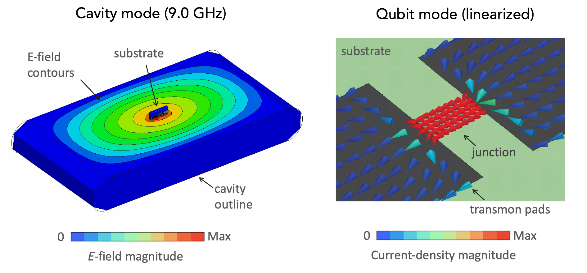
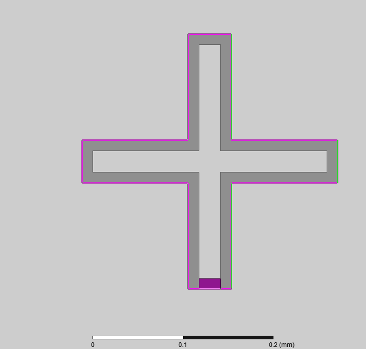

.. pyEPR documentation master file

*********************************************
pyEPR — Energy-Participation-Ratio Framework
*********************************************

**Version**: |version| | **License**: BSD-3-Clause | `GitHub <https://github.com/zlatko-minev/pyEPR>`_ | `PyPI <https://pypi.org/project/pyEPR-quantum/>`_

----

**pyEPR** is an open-source Python library for the automated design and
quantization of Josephson quantum circuits.  It bridges classical distributed
microwave simulation (Ansys HFSS) and quantum circuit Hamiltonians using the
`energy-participation ratio (EPR) <https://arxiv.org/abs/2010.00620>`_ method.

What pyEPR does
===============

pyEPR has two main layers:

1. **EPR / quantum analysis** *(platform-independent)*
   Extracts energy-participation ratios from HFSS eigenmode field solutions,
   then performs numerical diagonalization (via `QuTiP <https://qutip.org>`_)
   to yield qubit frequencies, anharmonicities, dispersive shifts (χ), and
   cross-Kerr couplings — all in one automated pipeline.

2. **Ansys HFSS COM interface** *(Windows-first; see* :ref:`install-platform` *)*
   A Python wrapper around the HFSS COM/DCOM automation API.  Controls
   simulation setup, field extraction, and optimetric sweeps directly from
   Python.  Originally written before `PyAEDT <https://github.com/ansys/pyaedt>`_
   existed; the two tools are complementary — pyEPR for quantum EPR analysis,
   PyAEDT for general AEDT scripting.

Quick install
=============

.. tabs::

   .. tab:: uv *(recommended)*

      .. code-block:: bash

         uv pip install pyEPR-quantum

   .. tab:: pip

      .. code-block:: bash

         pip install pyEPR-quantum

   .. tab:: conda

      .. code-block:: bash

         conda install -c conda-forge pyepr-quantum

See :ref:`install` for full instructions including development installs,
platform notes, and Ansys version compatibility.

Quick-start example
===================

The following script connects to HFSS, extracts EPR data, and produces the
full Hamiltonian for a two-qubit / one-cavity chip in a few lines of code.

.. code-block:: python

   import pyEPR as epr

   # 1. Connect to HFSS project
   pinfo = epr.ProjectInfo(
       project_path = r'C:\sim_folder',
       project_name = r'cavity_with_two_qubits',
       design_name  = r'Alice_Bob',
   )

   # 2. Specify Josephson junctions
   pinfo.junctions['jAlice'] = {
       'Lj_variable': 'Lj_alice', 'rect': 'rect_alice',
       'line': 'line_alice', 'Cj_variable': 'Cj_alice',
   }
   pinfo.junctions['jBob'] = {
       'Lj_variable': 'Lj_bob', 'rect': 'rect_bob',
       'line': 'line_bob', 'Cj_variable': 'Cj_bob',
   }
   pinfo.validate_junction_info()

   # 3. Run EPR field extraction
   eprd = epr.DistributedAnalysis(pinfo)
   eprd.do_EPR_analysis()

   # 4. Quantum Hamiltonian diagonalization
   epra = epr.QuantumAnalysis(eprd.data_filename)
   epra.analyze_all_variations(cos_trunc=8, fock_trunc=7)
   epra.plot_hamiltonian_results(swp_variable='Lj_alice')

See the `Jupyter notebook tutorials
<https://github.com/zlatko-minev/pyEPR/tree/master/_tutorial_notebooks>`_
for step-by-step walkthroughs.

Contents
========

.. toctree::
   :maxdepth: 2
   :numbered:

   about.rst
   installation.rst
   examples_quick.rst
   key_classes_reference.rst

.. toctree::
   :caption: API Reference:
   :glob:

   api/*

Indices and tables
==================

* :ref:`genindex`
* :ref:`modindex`
* :ref:`search`
